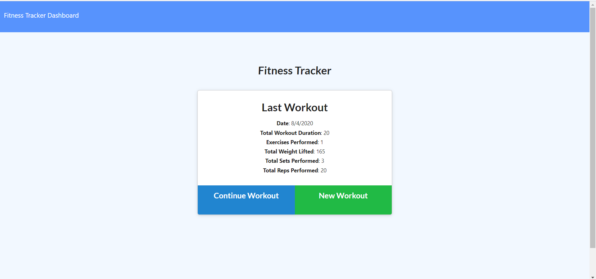
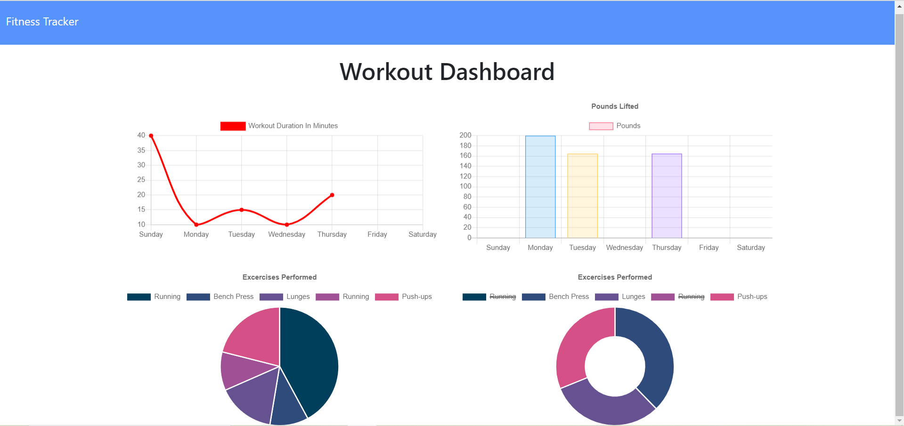

# Workout Tracker

Deployed Application: https://powerful-woodland-16821.herokuapp.com/

## Description

This application tracks a user's daily workouts.

## Table of Contents

* [Installation](#installation)
* [Usage](#usage)
* [Credits](#credits)
* [License](#license)
* [Questions](#questions)

## Installation

In the development environment, first run "npm install" to install the necessary dependencies. Then, run "npm start" to run the application locally.

## Usage

Click "New Workout" to record an exercise. Then select an exercise type (either resistance or cardio). Finally, fill in the provided input fields to record an exercise. The exercise type, name and duration are required fields. A workout can have many exercises. When finished filling out the inputs for an exercise, click "Add Exercise" to add another exercise, or "Complete" after filling in the last exercise in a workout. Click "Dashboard" in the navigation bar to view interesting visualizations of workout data entered.

Main Page:

Dashboard:

## Credits

Built with the support of instructors and colleagues from the University of Washington Coding Boot Camp!

## License

## Questions

Email me at <billyhao12@gmail.com>
